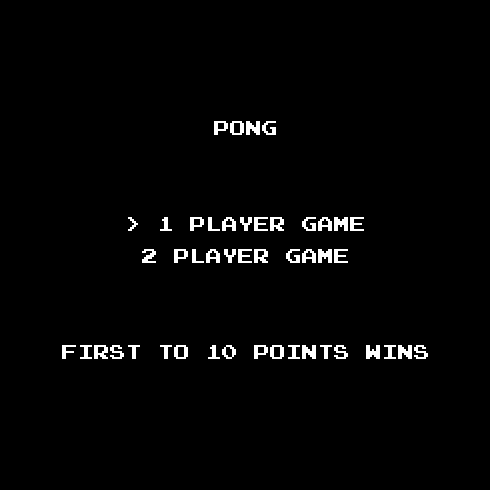

# Pong SDL2
Primitive Pong replica. This project exists entirely to dip my toes into C++, a language I am not entirely familiar with.

# Compilation
This project was created in Visual Studio 2019. If you'd like to run it, just download the project and replace my SDL2 references with yours in the Visual Studio solution. The project uses **SDL2** and **SDL2_ttf 2.0**.